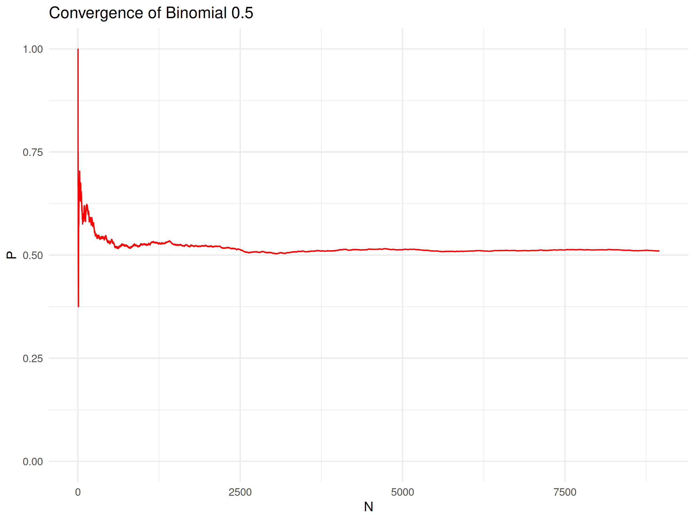
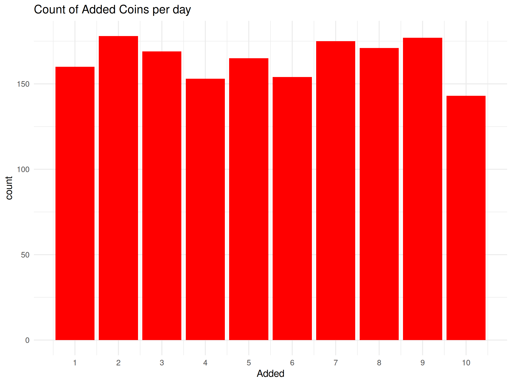

# Status of the operation
  
  This is a daily random binomial generator.
  
## Procces info

|     | Session|Date                       |       Seed| Added|
|:----|-------:|:--------------------------|----------:|-----:|
|1491 |    1491|2026-02-13 08:43:27.179928 | 1770972207|    10|
|1492 |    1492|2026-02-14 08:34:24.642523 | 1771058065|     8|
|1493 |    1493|2026-02-15 08:34:55.598365 | 1771144496|     2|
|1494 |    1494|2026-02-16 08:50:07.672019 | 1771231808|     2|
|1495 |    1495|2026-02-17 08:46:14.193488 | 1771317974|     3|
|1496 |    1496|2026-02-18 08:45:18.300545 | 1771404318|     6|
|1497 |    1497|2026-02-19 08:44:19.699669 | 1771490660|     9|
|1498 |    1498|2026-02-20 08:41:30.269157 | 1771576890|     9|
|1499 |    1499|2026-02-21 08:32:25.311607 | 1771662745|     9|
|1500 |    1500|2026-02-22 08:33:43.911509 | 1771749224|    10|
|1501 |    1501|2026-02-23 08:52:34.946767 | 1771836755|     9|
|1502 |    1502|2026-02-24 08:50:46.613237 | 1771923047|     7|
|1503 |    1503|2026-02-25 08:51:24.103889 | 1772009484|     4|
|1504 |    1504|2026-02-26 08:50:50.937026 | 1772095851|     5|
|1505 |    1505|2026-02-27 08:42:03.014892 | 1772181723|     1|
|1506 |    1506|2026-02-28 08:31:09.634698 | 1772267470|     7|
|1507 |    1507|2026-03-01 08:32:49.467074 | 1772353969|    10|
|1508 |    1508|2026-03-02 08:45:03.730868 | 1772441104|     2|
|1509 |    1509|2026-03-03 08:42:30.721223 | 1772527351|     9|
|1510 |    1510|2026-03-04 08:40:47.461622 | 1772613647|     3|

## Charts 

## End

Thats it, thanks for watching!
