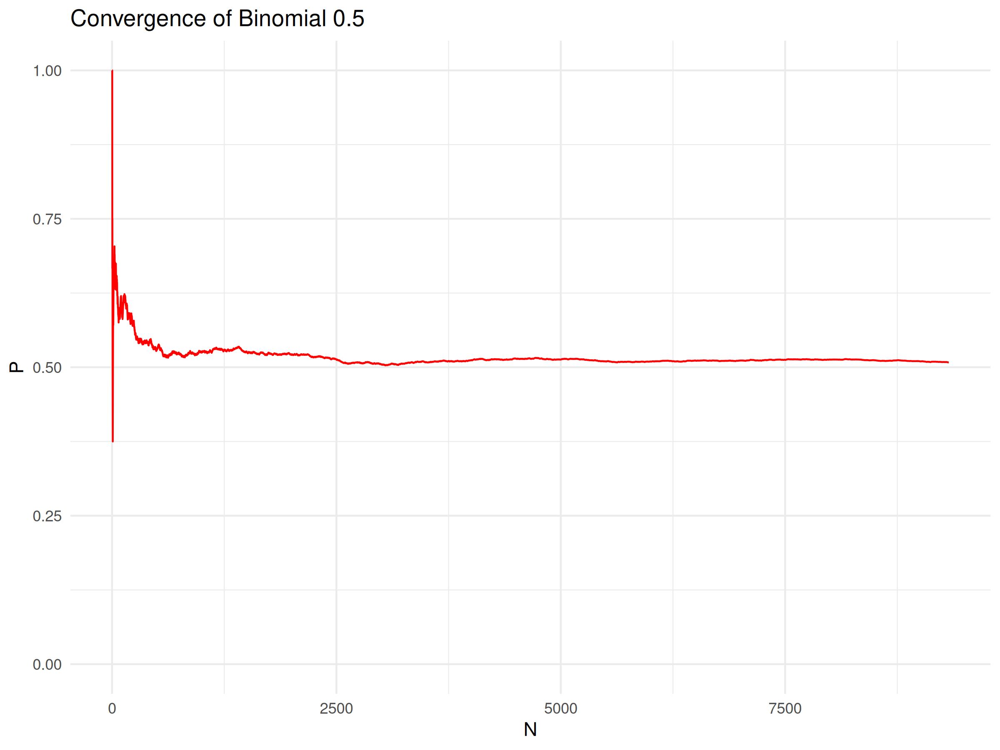
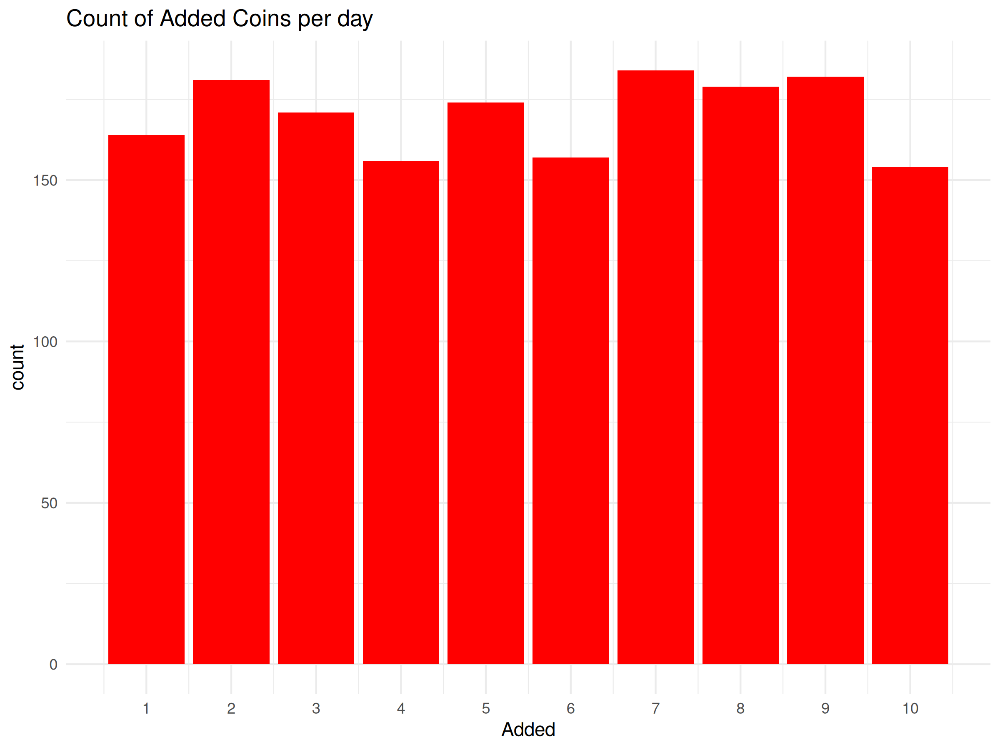

# Status of the operation
  
  This is a daily random binomial generator.
  
## Procces info

|     | Session|Date                       |       Seed| Added|
|:----|-------:|:--------------------------|----------:|-----:|
|1641 |    1641|2026-07-14 09:57:11.656127 | 1784023032|     2|
|1642 |    1642|2026-07-15 10:01:29.028606 | 1784109689|     4|
|1643 |    1643|2026-07-16 10:07:45.427407 | 1784196465|     9|
|1644 |    1644|2026-07-17 09:56:18.850416 | 1784282179|     3|
|1645 |    1645|2026-07-18 09:24:35.01431  | 1784366675|     1|
|1646 |    1646|2026-07-19 09:51:26.938124 | 1784454687|     7|
|1647 |    1647|2026-07-20 10:51:14.182797 | 1784544674|     9|
|1648 |    1648|2026-07-21 10:24:37.533074 | 1784629478|     7|
|1649 |    1649|2026-07-22 10:24:07.157104 | 1784715847|     2|
|1650 |    1650|2026-07-23 10:21:21.55031  | 1784802082|    10|
|1651 |    1651|2026-07-24 10:15:21.69357  | 1784888122|    10|
|1652 |    1652|2026-07-25 09:46:11.119215 | 1784972771|    10|
|1653 |    1653|2026-07-26 09:57:56.806687 | 1785059877|     9|
|1654 |    1654|2026-07-27 11:20:30.986412 | 1785151231|     8|
|1655 |    1655|2026-07-28 10:34:09.054808 | 1785234849|     5|
|1656 |    1656|2026-07-29 10:37:57.324614 | 1785321477|     7|
|1657 |    1657|2026-07-30 10:24:25.718083 | 1785407066|     5|
|1658 |    1658|2026-07-31 10:37:33.283535 | 1785494253|     9|
|1659 |    1659|2026-08-01 09:57:39.025742 | 1785578259|     5|
|1660 |    1660|2026-08-02 09:55:45.30215  | 1785664545|     7|

## Charts 

## End

Thats it, thanks for watching!
