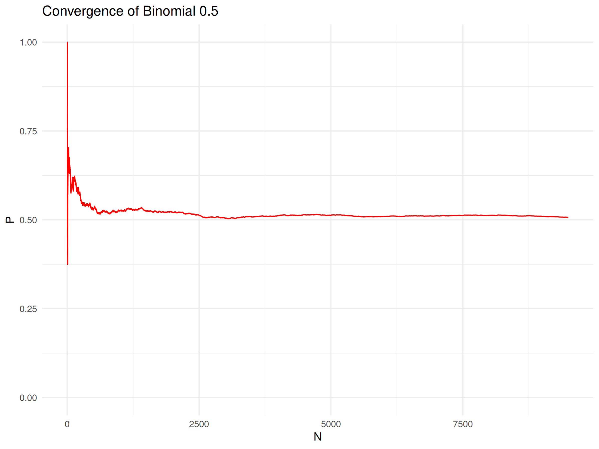
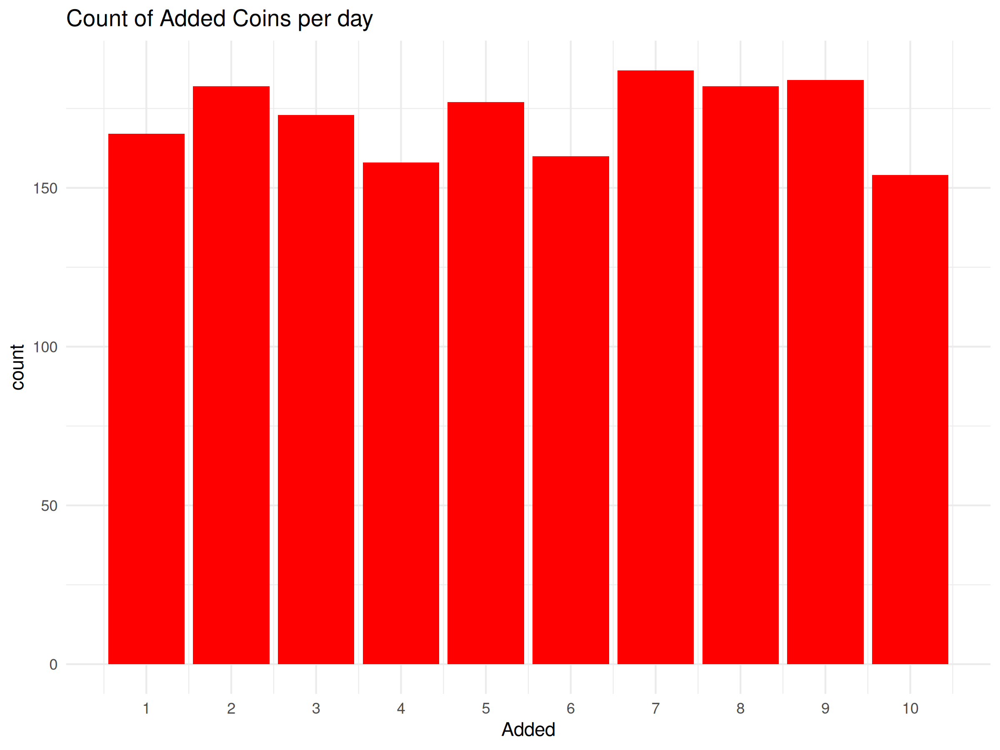

# Status of the operation
  
  This is a daily random binomial generator.
  
## Procces info

|     | Session|Date                       |       Seed| Added|
|:----|-------:|:--------------------------|----------:|-----:|
|1707 |    1707|2026-09-18 12:44:33.241143 | 1789735473|     9|
|1708 |    1708|2026-09-20 12:52:48.846741 | 1789908769|     8|
|1709 |    1709|2026-09-21 14:52:08.338914 | 1790002328|     1|
|1710 |    1710|2026-09-22 13:08:18.881353 | 1790082499|     7|
|1711 |    1711|2026-09-23 13:22:50.470475 | 1790169770|     5|
|1712 |    1712|2026-09-24 13:14:58.390684 | 1790255698|     7|
|1713 |    1713|2026-09-25 13:16:11.724957 | 1790342172|     6|
|1714 |    1714|2026-09-26 12:41:25.428747 | 1790426485|     8|
|1715 |    1715|2026-09-27 13:32:58.344045 | 1790515978|     8|
|1716 |    1716|2026-09-28 16:29:02.19452  | 1790612942|     7|
|1717 |    1717|2026-09-29 14:38:28.862869 | 1790692709|     3|
|1718 |    1718|2026-09-30 14:49:01.70147  | 1790779742|     9|
|1719 |    1719|2026-10-01 15:11:14.093452 | 1790867474|     6|
|1720 |    1720|2026-10-02 14:29:08.133123 | 1790951348|     6|
|1721 |    1721|2026-10-03 13:03:52.705043 | 1791032633|     4|
|1722 |    1722|2026-10-04 13:43:10.627358 | 1791121391|     2|
|1723 |    1723|2026-10-05 16:50:02.590561 | 1791219003|     1|
|1724 |    1724|2026-10-06 14:46:11.270042 | 1791297971|     4|
|1725 |    1725|2026-10-07 15:22:27.518646 | 1791386548|     8|
|1726 |    1726|2026-10-08 15:14:25.260704 | 1791472465|     1|

## Charts 

## End

Thats it, thanks for watching!
