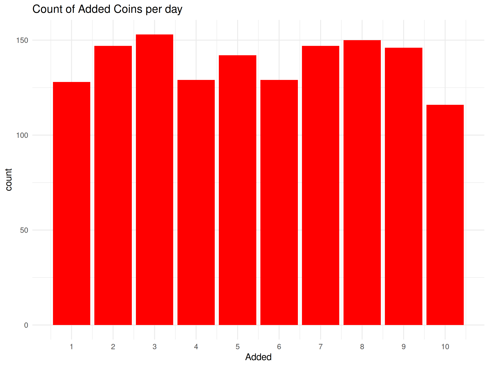

# Status of the operation
  
  This is a daily random binomial generator.
  
## Procces info

|     | Session|Date                       |       Seed| Added|
|:----|-------:|:--------------------------|----------:|-----:|
|1460 |    1460|2026-01-13 08:32:08.365606 | 1768293128|     1|
|1461 |    1461|2026-01-14 08:31:57.746344 | 1768379518|     1|
|1462 |    1462|2026-01-15 08:32:41.297733 | 1768465961|     6|
|1463 |    1463|2026-01-16 08:31:35.040401 | 1768552295|    10|
|1464 |    1464|2026-01-17 08:27:49.490757 | 1768638469|     6|
|1465 |    1465|2026-01-18 08:28:25.224411 | 1768724905|     4|
|1466 |    1466|2026-01-19 08:34:46.092606 | 1768811686|     8|
|1467 |    1467|2026-01-20 08:33:45.755022 | 1768898026|     3|
|1468 |    1468|2026-01-21 08:33:42.113767 | 1768984422|     7|
|1469 |    1469|2026-01-22 08:34:16.470584 | 1769070856|     8|
|1470 |    1470|2026-01-23 08:31:50.736836 | 1769157111|     9|
|1471 |    1471|2026-01-24 08:28:41.959162 | 1769243322|     6|
|1472 |    1472|2026-01-25 08:29:27.90089  | 1769329768|     1|
|1473 |    1473|2026-01-26 08:34:35.566861 | 1769416476|     8|
|1474 |    1474|2026-01-27 08:35:10.687793 | 1769502911|     8|
|1475 |    1475|2026-01-28 08:34:05.893505 | 1769589246|    10|
|1476 |    1476|2026-01-29 08:40:51.554826 | 1769676052|     6|
|1477 |    1477|2026-01-30 08:40:34.872712 | 1769762435|     1|
|1478 |    1478|2026-01-31 08:32:08.044356 | 1769848328|     1|
|1479 |    1479|2026-02-01 08:34:00.712821 | 1769934841|     9|

## Charts 

## End

Thats it, thanks for watching!
